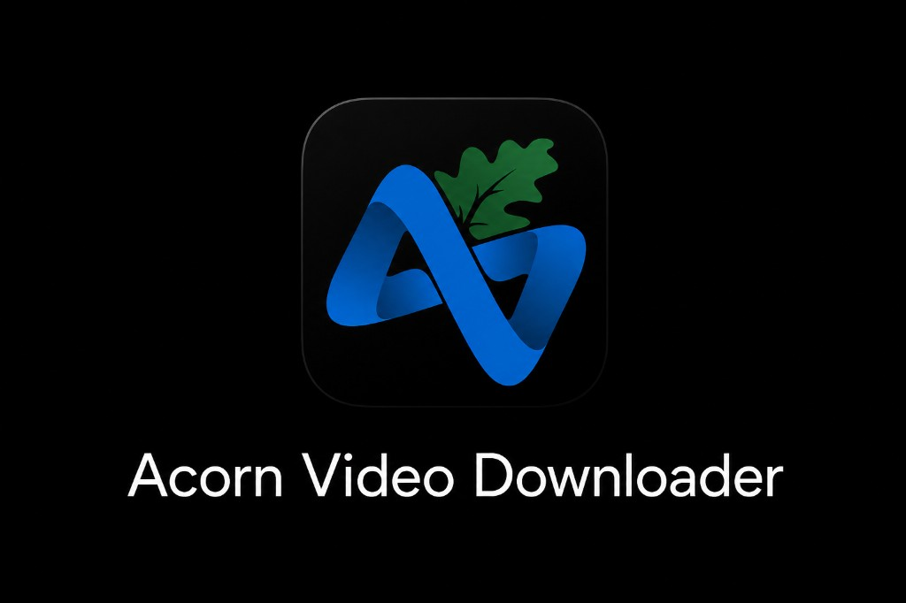
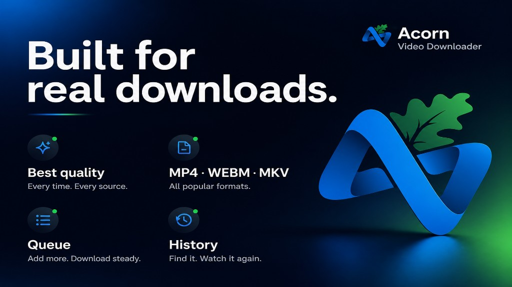
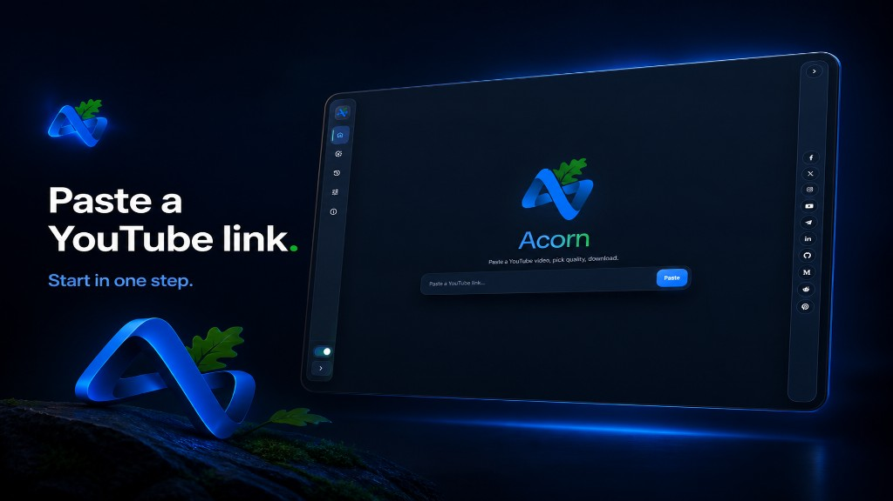
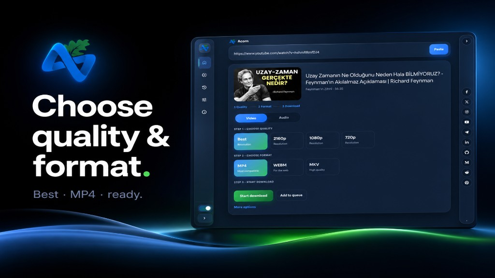
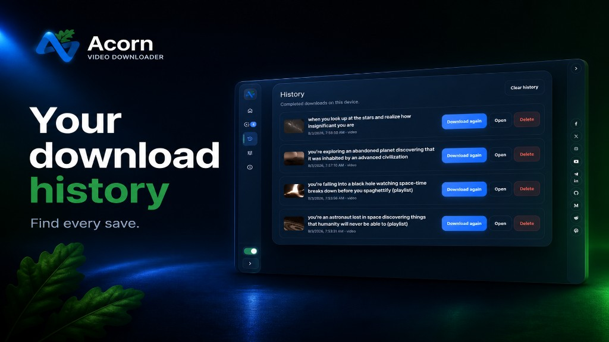
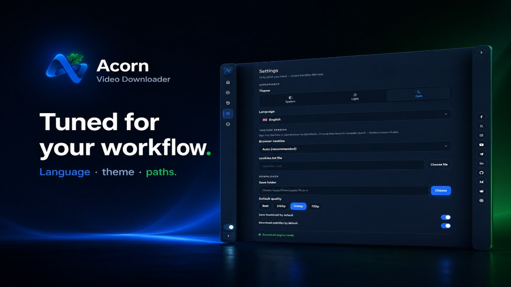
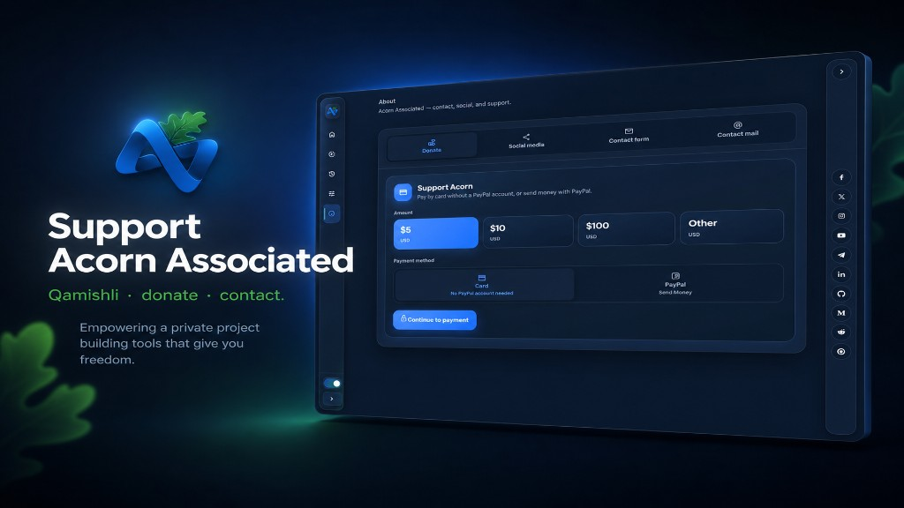

<!-- markdownlint-disable MD033 MD041 -->
<p align="center">
  
</p>

<h1 align="center">Acorn Video Downloader</h1>

<p align="center">
  <strong>Paste a link · Pick quality · Download</strong><br/>
  <sub>Cross-platform YouTube downloader — Tauri 2 · React · yt-dlp</sub>
</p>

<p align="center">
  <a href="https://github.com/acornassociated-22/AcornVideoDownloader/releases/latest"></a>
  <a href="https://github.com/acornassociated-22/AcornVideoDownloader/stargazers"></a>
  <a href="https://github.com/acornassociated-22/AcornVideoDownloader/releases/latest/download/acorn-video-downloader_0.1.0_aarch64.apk"></a>
</p>

<p align="center">
  <a href="https://github.com/acornassociated-22/AcornVideoDownloader/releases/latest"><strong>⬇ Download latest release</strong></a>
  &nbsp;·&nbsp;
  <a href="#-screenshots">Screenshots</a>
  &nbsp;·&nbsp;
  <a href="docs/USER_GUIDE.md">User guide</a>
  &nbsp;·&nbsp;
  <a href="docs/BUILD.md">Build</a>
  &nbsp;·&nbsp;
  <a href="#-support--acorn-associated">Support</a>
</p>

<p align="center">
  
</p>

---

## ⚡ Download

<table>
  <thead>
    <tr>
      <th align="left">Platform</th>
      <th align="left">Package</th>
      <th align="left">Get it</th>
    </tr>
  </thead>
  <tbody>
    <tr>
      <td><strong>Android</strong> (arm64)</td>
      <td><code>.apk</code> · signed</td>
      <td><a href="https://github.com/acornassociated-22/AcornVideoDownloader/releases/latest/download/acorn-video-downloader_0.1.0_aarch64.apk"><strong>Download APK</strong></a></td>
    </tr>
    <tr>
      <td><strong>Linux</strong> (amd64)</td>
      <td><code>.deb</code> · <code>.zip</code></td>
      <td><a href="https://github.com/acornassociated-22/AcornVideoDownloader/releases/latest">Releases</a></td>
    </tr>
    <tr>
      <td><strong>Linux</strong> (aarch64)</td>
      <td><code>.zip</code></td>
      <td><a href="https://github.com/acornassociated-22/AcornVideoDownloader/releases/latest">Releases</a></td>
    </tr>
    <tr>
      <td><strong>Windows</strong></td>
      <td><code>.exe</code> · <code>.msi</code></td>
      <td><a href="docs/BUILD.md">Build from source</a></td>
    </tr>
    <tr>
      <td><strong>macOS</strong></td>
      <td><code>.dmg</code></td>
      <td><a href="docs/BUILD.md">Build from source</a></td>
    </tr>
  </tbody>
</table>

> **New here?** Start with the **[User Guide](docs/USER_GUIDE.md)** — setup, queue, cookies, troubleshooting & FAQ.

---

## ✨ Features

<p align="center">
  
</p>

<table>
  <tr>
    <td width="50%" valign="top">
      <h3>🎬 Download</h3>
      <ul>
        <li>Best · 2160p · 1080p · 720p</li>
        <li>MP4 · WEBM · MKV · MP3 · M4A</li>
        <li>Subtitles & thumbnail options</li>
        <li>Playlist multi-select & queue</li>
      </ul>
    </td>
    <td width="50%" valign="top">
      <h3>🛡 Smart & private</h3>
      <ul>
        <li>One-by-one queue with live progress</li>
        <li>Download history — open & re-fetch</li>
        <li>YouTube cookie / sign-in support</li>
        <li>No tracking — files stay on device</li>
      </ul>
    </td>
  </tr>
  <tr>
    <td valign="top">
      <h3>🌍 Global</h3>
      <ul>
        <li>11 languages (EN · TR · AR · KU · RU · FR · FA · DE · VI · JA · ZH)</li>
        <li>Light · dark · system theme</li>
      </ul>
    </td>
    <td valign="top">
      <h3>📱 Android</h3>
      <ul>
        <li>Foreground downloads & notifications</li>
        <li>Share intent · safe bulk mode</li>
        <li>yt-dlp auto-update when idle</li>
      </ul>
    </td>
  </tr>
</table>

---

## 📸 Screenshots

<table>
  <tr>
    <td width="50%" align="center">
      <b>Home</b><br/>
      <a href="docs/assets/home.png"></a>
    </td>
    <td width="50%" align="center">
      <b>Quality & format</b><br/>
      <a href="docs/assets/download.png"></a>
    </td>
  </tr>
  <tr>
    <td align="center">
      <b>History</b><br/>
      <a href="docs/assets/history.png"></a>
    </td>
    <td align="center">
      <b>Settings</b><br/>
      <a href="docs/assets/settings.png"></a>
    </td>
  </tr>
  <tr>
    <td colspan="2" align="center">
      <b>About & support</b><br/>
      <a href="docs/assets/about.png"></a>
    </td>
  </tr>
</table>

---

## 🚀 Quick start

<details open>
<summary><strong>Android</strong></summary>

1. Download the **[APK](https://github.com/acornassociated-22/AcornVideoDownloader/releases/latest/download/acorn-video-downloader_0.1.0_aarch64.apk)** and install.
2. Paste a YouTube URL → pick quality & format → **Start download**.
3. Playlists → select videos → **Add to queue**.
4. Bot block? **Settings → Sign in to YouTube** or import `cookies.txt`.

</details>

<details>
<summary><strong>Desktop (Linux · Windows · macOS)</strong></summary>

1. Grab a package from **[Releases](https://github.com/acornassociated-22/AcornVideoDownloader/releases/latest)** or [build from source](docs/BUILD.md).
2. Launch Acorn → paste link → 3-step wizard.
3. Set save folder & defaults in **Settings**.

</details>

<details>
<summary><strong>Queue tips</strong></summary>

- Downloads run **one at a time** — queue many, Acorn paces them.
- **Clear finished** removes completed / failed / cancelled rows.
- **Cancel** stops active work; **Remove** drops a waiting item.
- On Android: allow notifications & disable battery optimization for Acorn.

</details>

---

## 📚 Docs

| | |
|---|---|
| [User Guide](docs/USER_GUIDE.md) | Full manual for every screen |
| [Build guide](docs/BUILD.md) | Dev setup & packaging |
| [Release notes](docs/RELEASE_NOTES_v0.1.0.md) | v0.1.0 changelog |

---

## 🛠 Build from source

```bash
git clone https://github.com/acornassociated-22/AcornVideoDownloader.git
cd AcornVideoDownloader
./scripts/install.sh && ./scripts/run.sh
npm run package:apk    # Android
npm run package:deb    # Linux .deb
```

---

## 🧩 Tech stack

| Layer | Stack |
|:--|:--|
| UI | React 19 · TypeScript · Tailwind 4 |
| Shell | Tauri 2 |
| State | Zustand |
| Engine | yt-dlp · FFmpeg |
| Android | Kotlin orchestrator · foreground service |

---

## 💜 Support & Acorn Associated

<p align="center">
  
</p>

<p align="center">
  <a href="https://www.acornik.com"><strong>Acornik.com</strong></a>
  &nbsp;·&nbsp;
  <a href="https://acornassociated.org/"><strong>acornassociated.org</strong></a>
</p>

<p align="center"><em>Empowering minds. Building tech capacity.</em> · Qamishli</p>

<details open>
<summary><strong>📧 Contact</strong></summary>

| | |
|---|---|
| Info | [Info@acornassociated.org](mailto:Info@acornassociated.org) |
| Sales | [Sales@acornassociated.org](mailto:Sales@acornassociated.org) |
| Support | [Support@acornassociated.org](mailto:Support@acornassociated.org) |
| PayPal | [acornassociatedorg@gmail.com](mailto:acornassociatedorg@gmail.com) |

[Open an issue](https://github.com/acornassociated-22/AcornVideoDownloader/issues) · bug reports welcome

</details>

<details>
<summary><strong>🌐 Social media</strong></summary>

<p align="center">
  <a href="https://www.facebook.com/share/1BHdij74U4/">Facebook</a> ·
  <a href="https://x.com/Acornassociate2">X</a> ·
  <a href="https://www.instagram.com/acornassociated">Instagram</a> ·
  <a href="https://youtube.com/@acornassociated">YouTube</a> ·
  <a href="https://t.me/acornassociated">Telegram</a> ·
  <a href="https://www.linkedin.com/in/acorn-associated-4715b4424">LinkedIn</a> ·
  <a href="https://github.com/acornassociated-22">GitHub</a> ·
  <a href="https://medium.com/@social_3025">Medium</a> ·
  <a href="https://www.reddit.com/user/Acorn_Associated">Reddit</a> ·
  <a href="https://pin.it/6aHftNn8p">Pinterest</a>
</p>

</details>

<details>
<summary><strong>❤️ Donate</strong></summary>

**Card (Stripe — no PayPal account needed)**

| Amount | Link |
|:--:|:--|
| **$5** | [Stripe →](https://donate.stripe.com/test_6oU6oH2ac2dpaOl9uRfQI00) |
| **$10** | [Stripe →](https://donate.stripe.com/test_5kQ28r168dW71dLgXjfQI01) |
| **$100** | [Stripe →](https://donate.stripe.com/test_14A6oH6qs7xJbSp9uRfQI03) |
| **Other** | [Custom amount →](https://donate.stripe.com/test_3cI4gzg1219lcWtfTffQI02) |

**PayPal:** [acornassociatedorg@gmail.com](mailto:acornassociatedorg@gmail.com) · [Send Money →](https://www.paypal.com/myaccount/transfer/send/?recipient=acornassociatedorg%40gmail.com&currencyCode=USD&note=Acorn+Associated+support)

Or in-app: **About → Donate**

</details>

---

## ⚖ Legal

Acorn Video Downloader is for **personal use**. You must comply with YouTube's Terms of Service, copyright laws, and local regulations. Only download content you have the right to access.

---

<p align="center">
  <sub>© Acorn Associated · Built by <strong>Erik</strong> · All rights reserved</sub>
</p>
